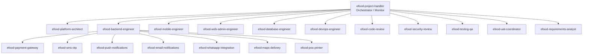

# e-Food Center — AI Skills Registry & Multi-Agent Strategy

> **Purpose:** Define the Cursor Agent Skills needed to build e-Food Center using AI-assisted coding with multitasking, expert delegation, and a top-level project handler.
> **Companion docs:** `REQUIREMENTS.md`, `PROJECT_PLAN.md`
> **Storage location:** Project skills → `.cursor/skills/<skill-name>/SKILL.md`
> **Last updated:** _YYYY-MM-DD_

---

## 1. Operating Model — Project Handler on Top

Use a **hub-and-spoke** model: one orchestrator skill delegates to domain experts; experts invoke integration specialists when needed; quality gates run before merge.



### How multitasking works in Cursor

| Pattern | When to use | Example |
|---------|-------------|---------|
| **Parallel Task agents** | Independent workstreams | Backend auth + mobile login screen + DB migration at same time |
| **Sequential with gates** | Dependent work | Architect approves API spec → backend implements → QA writes tests |
| **Project handler session** | Start of each work block | Read `PROJECT_PLAN.md` §7, pick tasks, spawn parallel agents, merge results |
| **Integration expert on demand** | Touching external systems | Backend agent invokes `efood-payment-gateway` when building checkout |

### Project handler responsibilities (always first)

1. Read `PROJECT_PLAN.md` progress tracker + current phase exit gate.
2. Read open items in Decision Register (§4) and blockers.
3. Break work into **parallel-safe** vs **sequential** tasks.
4. Assign each task to the right skill (see Section 3).
5. Enforce quality gates: code review → security (if payments/auth) → tests → update tracker.
6. Never start coding if Pre-Development Gate (Req §17) items are open.

---

## 2. Skill Tiers Summary

| Tier | Count | Role |
|------|-------|------|
| **T0 — Orchestration** | 1 | Monitor, delegate, track progress |
| **T1 — Platform & delivery** | 7 | Architecture, backend, mobile, web, DB, DevOps, UI/UX |
| **T2 — Integration experts** | 7 | Payment, SMS, push, email, WhatsApp, maps, POS/printer |
| **T3 — Quality & governance** | 5 | Code review, security, QA, UAT, requirements |
| **T4 — Launch & ops** | 3 | Performance/load, release/deploy, documentation |
| **Total project skills to create** | **24** | 23 registry + `efood-git-manager` |

**Reuse existing Cursor built-in skills** (no need to recreate):

| Built-in skill | Use for |
|----------------|---------|
| `review-bugbot` | Automated PR/change review |
| `review-security` | Security-focused review |
| `babysit` | Keep PR/CI merge-ready |
| `split-to-prs` | Split large changes into reviewable PRs |
| `loop` | Recurring status checks / CI watch |
| `create-skill` | Author new skills in this registry |

---

## 3. Full Skills List (What to Prepare)

Each skill gets: `name`, `description` (WHAT + WHEN), inputs it reads, outputs it produces, and which phase it is needed.

---

### T0 — Orchestration (create first)

#### 1. `efood-project-handler`

| Field | Value |
|-------|-------|
| **Purpose** | Top-level orchestrator. Monitors phase progress, assigns parallel work, enforces gates, updates `PROJECT_PLAN.md`. |
| **Invoke when** | Starting any work session; phase transitions; blockers; weekly status update |
| **Reads** | `REQUIREMENTS.md`, `PROJECT_PLAN.md`, git status, open decisions |
| **Produces** | Task breakdown, agent assignments, status update in §7, blocker list |
| **Phase** | All phases |
| **Priority** | **P0 — Create first** |

**Must instruct agent to:**
- Check Pre-Development Gate before Phase 2 coding
- Run max 2–4 parallel agents on independent streams
- Require review skill before marking task done
- Update milestone tracker after each completed item

---

### T1 — Platform & Delivery Experts

#### 2. `efood-platform-architect`

| Field | Value |
|-------|-------|
| **Purpose** | System architecture, ERD, API contracts, tech stack decisions, scalability & security design |
| **Invoke when** | Phase 1; any cross-cutting design change; scale/compliance questions |
| **Reads** | `REQUIREMENTS.md`, `PROJECT_PLAN.md` §3–4 |
| **Produces** | Architecture diagram, ERD, OpenAPI spec, ADRs (Architecture Decision Records) |
| **Phase** | P1, ongoing |
| **Priority** | **P0** |

**Scope (high level):** React Native + Node.js + PostgreSQL + managed cloud; multi-branch schema; queue for orders/notifications; India data residency; PCI-minimized payments.

---

#### 3. `efood-backend-engineer`

| Field | Value |
|-------|-------|
| **Purpose** | Node.js API — auth, catalog, cart, orders, coupons, admin APIs, business rules |
| **Invoke when** | Any server-side feature; order lifecycle; RBAC; auto-confirmation logic |
| **Reads** | OpenAPI spec, ERD, `REQUIREMENTS.md` §4 |
| **Produces** | API modules, services, validators, unit tests |
| **Phase** | P2–P5 |
| **Priority** | **P0** |

**Delegates to:** payment, SMS, push, email, maps, POS skills when touching those systems.

---

#### 4. `efood-mobile-engineer`

| Field | Value |
|-------|-------|
| **Purpose** | React Native (Expo) customer app — onboarding, catalog, cart, checkout, order tracking |
| **Invoke when** | Any customer-facing mobile screen or flow |
| **Reads** | Wireframes, API spec, design tokens |
| **Produces** | Mobile screens, navigation, API client, local state |
| **Phase** | P3–P5 |
| **Priority** | **P0** |

**Constraints:** Simple UX (few taps to order); support local language; guest browse + login at checkout.

---

#### 5. `efood-web-admin-engineer`

| Field | Value |
|-------|-------|
| **Purpose** | React admin panel + customer web app — product mgmt, orders, reports, banners, staff |
| **Invoke when** | Admin/ops UI; manager dashboards; web ordering parity |
| **Reads** | Wireframes, API spec, role–permission matrix |
| **Produces** | Admin modules, dashboards, CRUD screens |
| **Phase** | P3–P5 |
| **Priority** | **P0** |

---

#### 6. `efood-database-engineer`

| Field | Value |
|-------|-------|
| **Purpose** | PostgreSQL schema, migrations, indexes, seed data, query optimization |
| **Invoke when** | New entities; performance issues; data model changes |
| **Reads** | ERD, architect decisions |
| **Produces** | Migrations, seed scripts, index strategy |
| **Phase** | P2 onward |
| **Priority** | **P0** |

---

#### 7. `efood-devops-engineer`

| Field | Value |
|-------|-------|
| **Purpose** | Cloud infra, CI/CD, Dev/Staging/Prod, secrets, monitoring, backups |
| **Invoke when** | Environment setup; deploy pipelines; observability; DR drill |
| **Reads** | Architecture doc, `PROJECT_PLAN.md` Phase 2/6 |
| **Produces** | IaC, GitHub Actions / CI config, runbooks |
| **Phase** | P2, P6–P8 |
| **Priority** | **P0** |

---

#### 8. `efood-uiux-design`

| Field | Value |
|-------|-------|
| **Purpose** | Wireframes, design system (Tailwind tokens), simple flows for less-educated users |
| **Invoke when** | Phase 1 design; new screens; UX simplification |
| **Reads** | `REQUIREMENTS.md` §6, competitor notes (Zomato — simpler) |
| **Produces** | Screen list, wireframe specs, component library guidelines |
| **Phase** | P1, P3 |
| **Priority** | **P1** |

---

### T2 — Integration Experts (invoke on demand)

#### 9. `efood-payment-gateway`

| Field | Value |
|-------|-------|
| **Purpose** | Razorpay (or chosen gateway) — checkout, webhooks, refunds, payment status, COD tracking |
| **Invoke when** | Checkout, payment retry, refund, day-end COD reconciliation |
| **Reads** | Gateway docs, order/payment entities |
| **Produces** | Payment service, webhook handlers, reconciliation reports |
| **Phase** | P4 |
| **Priority** | **P0** |

**Rules:** Never store card data; use hosted checkout; idempotent webhooks; audit log all payment events.

---

#### 10. `efood-sms-otp`

| Field | Value |
|-------|-------|
| **Purpose** | SMS OTP login + transactional SMS (order confirmed, delivered) via MSG91/DLT |
| **Invoke when** | Auth OTP; SMS triggers per Req §4.5 matrix |
| **Reads** | DLT template IDs, provider credentials |
| **Produces** | OTP service, SMS templates, rate limiting |
| **Phase** | P2, P5 |
| **Priority** | **P0** |

---

#### 11. `efood-push-notifications`

| Field | Value |
|-------|-------|
| **Purpose** | Firebase Cloud Messaging — order status, offers |
| **Invoke when** | Push triggers; device token management |
| **Produces** | FCM integration, notification service, topic/user targeting |
| **Phase** | P5 |
| **Priority** | **P0** |

---

#### 12. `efood-email-notifications`

| Field | Value |
|-------|-------|
| **Purpose** | Transactional email — order confirmed, delivered; user opt-in/out |
| **Invoke when** | Email triggers; template setup; domain SPF/DKIM |
| **Produces** | Email service, templates, user preference flags |
| **Phase** | P5 (P2 priority in requirements) |
| **Priority** | **P1** |

---

#### 13. `efood-whatsapp-integration`

| Field | Value |
|-------|-------|
| **Purpose** | WhatsApp Business API — notifications, deep links (Phase 2) |
| **Invoke when** | Phase 9 / post-MVP WhatsApp features |
| **Produces** | WhatsApp message service, template approval flow |
| **Phase** | P9 |
| **Priority** | **P2 — defer until MVP stable** |

---

#### 14. `efood-maps-delivery`

| Field | Value |
|-------|-------|
| **Purpose** | Google Maps — address, geocoding, delivery zones, radius validation |
| **Invoke when** | Checkout address; delivery fee by zone; serviceability check |
| **Produces** | Zone model, geocoding service, fee calculation |
| **Phase** | P4 |
| **Priority** | **P0** |

---

#### 15. `efood-pos-printer`

| Field | Value |
|-------|-------|
| **Purpose** | Invoice/receipt generation — thermal/ESC-POS, admin print, PDF fallback |
| **Invoke when** | Order confirmation print; kitchen ticket; day-end reports |
| **Reads** | Hardware decision (D14) |
| **Produces** | Print service, receipt templates |
| **Phase** | P4 |
| **Priority** | **P1** |

---

### T3 — Quality & Governance

#### 16. `efood-code-review`

| Field | Value |
|-------|-------|
| **Purpose** | Project-specific code review — conventions, modularity, error handling, test coverage |
| **Invoke when** | Before every merge; after each agent completes a task |
| **Reads** | Changed files, project structure |
| **Produces** | Review report: Critical / Suggestion / Nice-to-have |
| **Phase** | All build phases |
| **Priority** | **P0** |

**Alternative:** Use built-in `review-bugbot` + this skill for e-Food-specific rules.

---

#### 17. `efood-security-review`

| Field | Value |
|-------|-------|
| **Purpose** | Security audit — auth, RBAC, MFA admin, PCI scope, DPDP, secrets, OWASP |
| **Invoke when** | Auth/payment/admin changes; before Phase 6 exit; before go-live |
| **Phase** | P2, P4, P6, P7 |
| **Priority** | **P0** |

**Alternative:** Use built-in `review-security` + this skill for India/DPDP/PCI context.

---

#### 18. `efood-testing-qa`

| Field | Value |
|-------|-------|
| **Purpose** | Unit, integration, E2E tests; test plans; regression suites |
| **Invoke when** | After each feature; Phase 6 hardening |
| **Reads** | User stories, acceptance criteria, API spec |
| **Produces** | Test files, coverage report, test plan |
| **Phase** | P3–P6 |
| **Priority** | **P0** |

---

#### 19. `efood-uat-coordinator`

| Field | Value |
|-------|-------|
| **Purpose** | UAT scripts for Sarthak; maps Req §15.2 checklist to step-by-step tests |
| **Invoke when** | Phase 7; feature ready for business validation |
| **Reads** | `REQUIREMENTS.md` §15, `PROJECT_PLAN.md` milestones |
| **Produces** | UAT script, defect log template, sign-off checklist |
| **Phase** | P7 |
| **Priority** | **P0** |

---

#### 20. `efood-requirements-analyst`

| Field | Value |
|-------|-------|
| **Purpose** | Keep `REQUIREMENTS.md` accurate; trace features to code; flag scope creep |
| **Invoke when** | New feature request; after workshops; before phase gates |
| **Produces** | Updated requirements, traceability matrix, change log entry |
| **Phase** | P0 onward |
| **Priority** | **P1** |

---

### T4 — Launch & Operations

#### 21. `efood-performance-load`

| Field | Value |
|-------|-------|
| **Purpose** | Load testing, profiling, optimization for 18k orders/day target |
| **Invoke when** | Phase 6; before go-live |
| **Produces** | Load test scripts, performance report, tuning recommendations |
| **Phase** | P6 |
| **Priority** | **P1** |

---

#### 22. `efood-release-deploy`

| Field | Value |
|-------|-------|
| **Purpose** | App store submission, release notes, go-live/rollback runbooks |
| **Invoke when** | Phase 7–8 |
| **Produces** | Store listings, release checklist, rollback procedure |
| **Phase** | P7–P8 |
| **Priority** | **P1** |

---

#### 23. `efood-documentation`

| Field | Value |
|-------|-------|
| **Purpose** | API docs, admin SOPs, incident runbooks, onboarding for Sarthak's team |
| **Invoke when** | End of each phase; before go-live |
| **Produces** | README, API reference, ops SOPs |
| **Phase** | P5–P8 |
| **Priority** | **P2** |

---

## 4. Creation Priority — What to Build First

Build skills in this order to maximize speed and reduce rework.

### Wave 1 — Foundation (before any coding) — Week 1

| Order | Skill | Why first |
|-------|-------|-----------|
| 1 | `efood-project-handler` | Orchestrates everything |
| 2 | `efood-platform-architect` | Locks design before code |
| 3 | `efood-requirements-analyst` | Keeps scope honest |
| 4 | `efood-database-engineer` | Schema is the foundation |

### Wave 2 — Core build — Weeks 2–8

| Order | Skill | Why |
|-------|-------|-----|
| 5 | `efood-backend-engineer` | API backbone |
| 6 | `efood-devops-engineer` | Environments early |
| 7 | `efood-mobile-engineer` | Customer app |
| 8 | `efood-web-admin-engineer` | Admin + web |
| 9 | `efood-uiux-design` | Wireframes if not done |

### Wave 3 — Integrations — Weeks 6–10

| Order | Skill | Why |
|-------|-------|-----|
| 10 | `efood-sms-otp` | Auth blocker |
| 11 | `efood-payment-gateway` | Revenue path |
| 12 | `efood-maps-delivery` | Checkout blocker |
| 13 | `efood-push-notifications` | Order updates |
| 14 | `efood-email-notifications` | Secondary channel |
| 15 | `efood-pos-printer` | Ops requirement |

### Wave 4 — Quality & launch — Weeks 10–18

| Order | Skill | Why |
|-------|-------|-----|
| 16 | `efood-code-review` | Every merge |
| 17 | `efood-security-review` | Before payments go-live |
| 18 | `efood-testing-qa` | Automated confidence |
| 19 | `efood-uat-coordinator` | Business sign-off |
| 20 | `efood-performance-load` | Scale validation |
| 21 | `efood-release-deploy` | Store + go-live |
| 22 | `efood-documentation` | Handover |
| 23 | `efood-whatsapp-integration` | Post-MVP only |

---

## 5. Skill ↔ Project Phase Mapping

| Project phase | Primary skills | Supporting skills |
|---------------|----------------|-------------------|
| **P0** Discovery | project-handler, requirements-analyst | platform-architect |
| **P1** Architecture & UX | platform-architect, uiux-design, database-engineer | requirements-analyst |
| **P2** Platform foundation | backend-engineer, devops-engineer, database-engineer, sms-otp | security-review, testing-qa |
| **P3** Catalog & browse | mobile-engineer, web-admin-engineer, backend-engineer | code-review, testing-qa |
| **P4** Orders & payments | backend-engineer, payment-gateway, maps-delivery, pos-printer | security-review, code-review |
| **P5** Ops & notifications | web-admin-engineer, push-notifications, email-notifications, backend-engineer | testing-qa |
| **P6** Hardening | performance-load, security-review, testing-qa, devops-engineer | code-review |
| **P7** UAT & launch prep | uat-coordinator, release-deploy, documentation | project-handler |
| **P8** Go-live | release-deploy, project-handler, devops-engineer | uat-coordinator |
| **P9** Post-MVP | whatsapp-integration, backend-engineer | requirements-analyst |

---

## 6. Multitasking Playbook (Fastest Output)

### Session start template (paste into Cursor)

```
@efood-project-handler

Read PROJECT_PLAN.md and REQUIREMENTS.md.
Current phase: [P0/P1/...]
Today's goal: [e.g. "Auth + OTP + user schema"]

1. List parallel-safe tasks
2. Assign skills to each
3. Define merge order and review gates
4. Update progress tracker when done
```

### Example parallel batch — Phase 2

| Agent | Skill | Task | Gate before merge |
|-------|-------|------|-------------------|
| Agent A | `efood-database-engineer` | User + auth schema migration | Architect review |
| Agent B | `efood-devops-engineer` | Staging env + CI pipeline | DevOps smoke test |
| Agent C | `efood-backend-engineer` + `efood-sms-otp` | OTP auth API skeleton | security-review + tests |
| **Orchestrator** | `efood-project-handler` | Monitor, resolve conflicts, update §7 | — |

### Rules for safe parallelism

1. **Same file = sequential** — never two agents editing the same module.
2. **API contract first** — architect publishes OpenAPI → backend + mobile proceed in parallel.
3. **Integrations isolated** — payment/SMS in separate service modules; one integration skill per PR.
4. **Review always** — no task marked done without `efood-code-review` (or `review-bugbot`).
5. **Payments/auth → security** — mandatory `efood-security-review` before merge.

---

## 7. Recommended Folder Structure

```
E-App/
├── REQUIREMENTS.md
├── PROJECT_PLAN.md
├── SKILLS_REGISTRY.md          ← this file
├── .cursor/
│   └── skills/
│       ├── efood-project-handler/
│       │   └── SKILL.md
│       ├── efood-platform-architect/
│       │   ├── SKILL.md
│       │   └── reference.md      ← ERD, stack decisions
│       ├── efood-backend-engineer/
│       │   └── SKILL.md
│       ├── efood-payment-gateway/
│       │   ├── SKILL.md
│       │   └── razorpay-reference.md
│       └── ... (one folder per skill)
```

Each `SKILL.md` should:
- Reference `REQUIREMENTS.md` and `PROJECT_PLAN.md`
- Stay under 500 lines (use `reference.md` for details)
- Include **Inputs**, **Outputs**, **Checklist**, **Do not** rules
- Set `disable-model-invocation: true` (invoke explicitly, except project-handler if you want ambient awareness)

---

## 8. Skill Authoring Checklist

Before marking a skill as ready:

- [ ] `name` is lowercase-hyphenated, ≤ 64 chars
- [ ] `description` includes WHAT + WHEN (third person)
- [ ] Points to project docs (`REQUIREMENTS.md`, `PROJECT_PLAN.md`)
- [ ] Lists concrete outputs (files, artifacts)
- [ ] Includes exit checklist / definition of done
- [ ] Under 500 lines; details in reference files
- [ ] Tested once in a real Cursor session

---

## 9. Quick Reference — All 23 Skills

| # | Skill name | Tier | Priority | Phase |
|---|------------|------|----------|-------|
| 1 | `efood-project-handler` | T0 | P0 | All |
| 2 | `efood-platform-architect` | T1 | P0 | P1+ |
| 3 | `efood-backend-engineer` | T1 | P0 | P2–P5 |
| 4 | `efood-mobile-engineer` | T1 | P0 | P3–P5 |
| 5 | `efood-web-admin-engineer` | T1 | P0 | P3–P5 |
| 6 | `efood-database-engineer` | T1 | P0 | P2+ |
| 7 | `efood-devops-engineer` | T1 | P0 | P2, P6–P8 |
| 8 | `efood-uiux-design` | T1 | P1 | P1, P3 |
| 9 | `efood-payment-gateway` | T2 | P0 | P4 |
| 10 | `efood-sms-otp` | T2 | P0 | P2, P5 |
| 11 | `efood-push-notifications` | T2 | P0 | P5 |
| 12 | `efood-email-notifications` | T2 | P1 | P5 |
| 13 | `efood-whatsapp-integration` | T2 | P2 | P9 |
| 14 | `efood-maps-delivery` | T2 | P0 | P4 |
| 15 | `efood-pos-printer` | T2 | P1 | P4 |
| 16 | `efood-code-review` | T3 | P0 | All build |
| 17 | `efood-security-review` | T3 | P0 | P2, P4, P6, P7 |
| 18 | `efood-testing-qa` | T3 | P0 | P3–P6 |
| 19 | `efood-uat-coordinator` | T3 | P0 | P7 |
| 20 | `efood-requirements-analyst` | T3 | P1 | P0+ |
| 21 | `efood-performance-load` | T4 | P1 | P6 |
| 22 | `efood-release-deploy` | T4 | P1 | P7–P8 |
| 23 | `efood-documentation` | T4 | P2 | P5–P8 |
| 24 | `efood-git-manager` | T0 | P0 | All |

---

## Change Log

| Version | Date | Author | Summary |
|---------|------|--------|---------|
| 0.1 | _YYYY-MM-DD_ | Somnath Das | Initial skills registry and multi-agent strategy |
