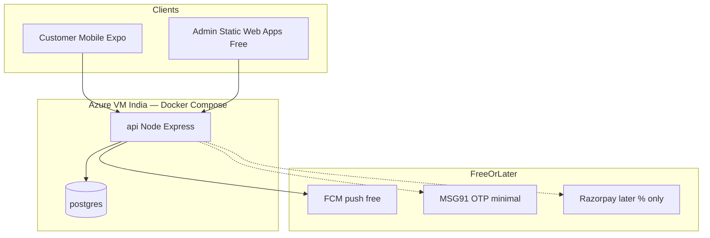
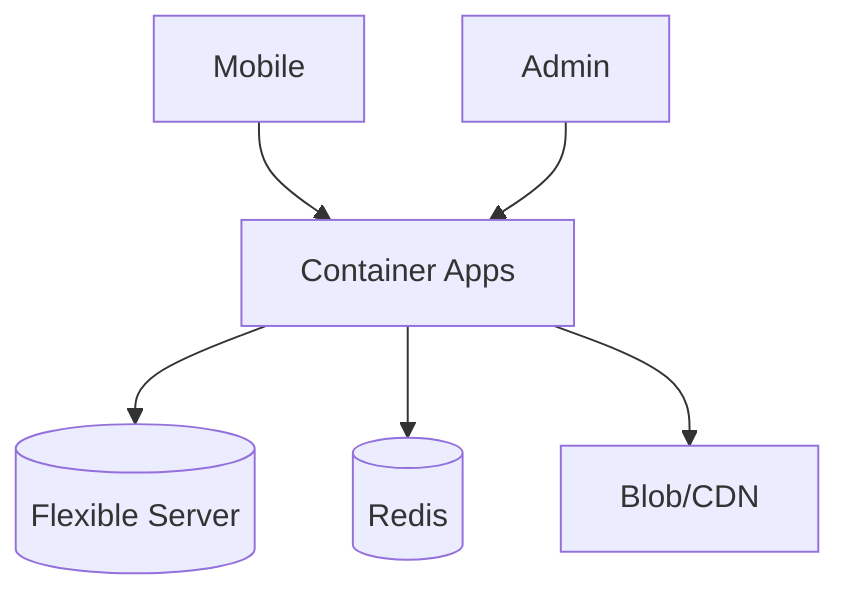
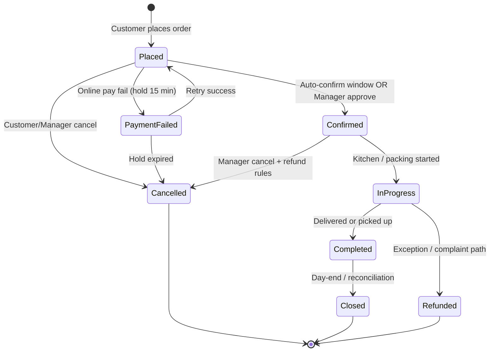
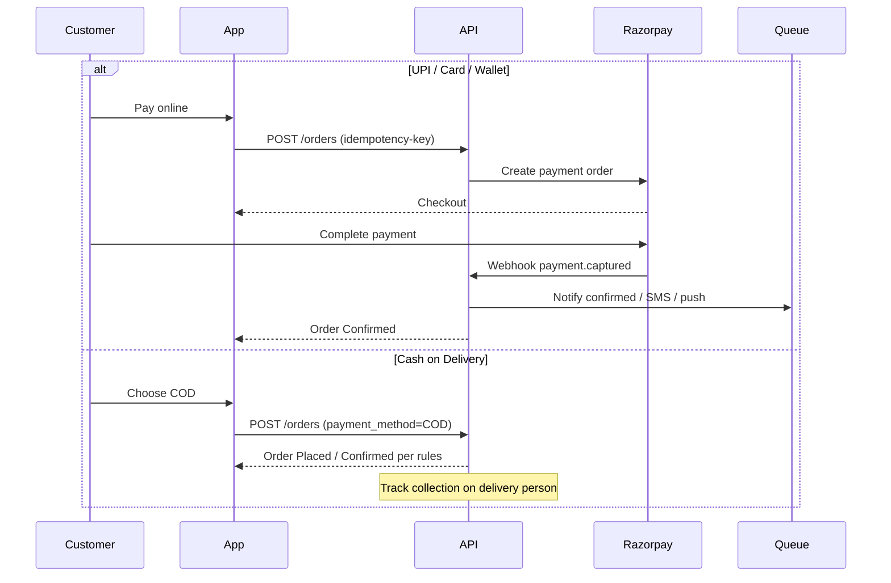

# e-Food Center — System Architecture

> **Status:** ✅ Approved  
> **Version:** 0.1  
> **Approved on:** 2026-07-17  
> **Owner:** Somnath Das (Tech Lead)  
> **Reviewers:** Sarthak Ghosh (Business) · Somnath Das (Architecture)  
> **Companion docs:** `docs/erd.md` · `docs/wireframes/` · `docs/APPROVAL_CHECKLIST.md` · `docs/openapi.yaml`

---

## 1. Purpose

Lock the technical blueprint before build starts so that:

- Business owner can approve scope, channels, and operational flow
- Mobile, admin, and API teams can work in parallel from one contract
- Security, scale, and India data residency are designed in from day one

---

## 2. Architecture principles

| Principle | How we apply it |
|-----------|-----------------|
| Cost-first launch | One always-on VM + Compose; defer managed DB/Redis/CDN/Maps until needed |
| Scalable-by-design | Modular API so Stage C (ACA + managed data) does not require rewrite |
| Security-by-design | OTP auth, JWT + refresh, RBAC; no card storage (Razorpay only when enabled) |
| Operable | Health checks, nightly DB dump, simple restore runbook (HA later) |
| Maintainable | Monorepo, OpenAPI source of truth, Dev → Staging → Prod |
| MVP-first | Basic order flow only; fancy features on stakeholder request |
| Simple UX | Locked wireframes; stable UI; no drive-by redesigns |

---

## 3. Locked stack (Lean Launch → Scale)

> **Cost-first:** Stage A/B is the live architecture now. Stage C is the growth path (ADR 002).  
> Detail: `docs/azure-docker-cost.md` · ADR 003 (launch) · ADR 002 (scale).

### Stage A/B — Lean Launch (startup default)

| Layer | Choice | Why |
|-------|--------|-----|
| Customer mobile | React Native (Expo) — **Android first**; iOS when budget allows | Defer Apple $99 if needed |
| Admin panel | React + Vite on **Azure Static Web Apps Free** | ₹0 hosting |
| API | Node.js + Express (TypeScript) `/api/v1` in **Docker** | Modular monolith |
| Hosting | **One Azure Linux VM (India) + Docker Compose** | Always-on; cheapest reliable Docker |
| Database | **PostgreSQL in Compose on same VM** | No managed-DB bill at launch |
| Cache / queue | **None at launch** (inline push; cron later) | Defer Redis cost |
| Media | Local disk or tiny Blob | Defer CDN |
| Auth | Phone OTP (MSG91) when public; JWT | Minimize SMS |
| Payments | **COD first**; Razorpay UPI later (no monthly fee) | Least cost |
| Push | **FCM** (free) for order status | Avoid order SMS |
| Maps | **Deferred** — text address + pincode/zone list | ₹0 |
| Email / WhatsApp | Deferred until stakeholder asks | ₹0 |

### Stage C — Scale path (later)

Azure Container Apps + managed PostgreSQL Flexible + Redis + ACR/Blob/CDN — only when one VM is not enough or revenue justifies (see ADR 002).

---

## 4. High-level system context

### 4.1 Lean Launch (now)



### 4.2 Scale path (Stage C — future)



---

## 5. Logical components

| Component | Responsibility |
|-----------|----------------|
| **Auth service** | OTP send/verify, JWT issue/refresh, RBAC claims, admin MFA |
| **Catalog service** | Categories, products, stock by branch, search |
| **Cart & order engine** | Min-qty rules, coupons, delivery/pickup, lifecycle state machine |
| **Payment service** | COD first; Razorpay create/webhook when enabled |
| **Notification** | FCM first; SMS OTP minimal; queue/worker when Redis added (Stage C) |
| **Admin ops** | Orders queue, products, users, staff, reports, banners |
| **Audit** | Immutable log of price, order, admin, and payment state changes |

MVP may ship as a **modular monolith** (one API deployable) with clear module boundaries — not microservices on day one. Extract services later if scale requires it.

---

## 6. Order lifecycle (system of record)



### Business rules encoded in architecture

| Rule | Implementation |
|------|----------------|
| Auto-confirm 6am–3pm (configurable) | Scheduler + branch timezone; manager override |
| Edit within 5 min OR before dispatch | Order version + status gate |
| Min qty per item | Product rule table; validate on cart + place |
| COD day-end collection | Delivery person assignment + reconciliation report |
| Refund small deduction (₹1–₹2) | Refund policy config; never hardcode in UI only |
| Guest browse, login at checkout | Public catalog APIs; auth required on `POST /orders` |

---

## 7. Auth & security design

```mermaid
sequenceDiagram
  participant U as Customer
  participant App as Mobile App
  participant API as API
  participant SMS as MSG91
  participant DB as PostgreSQL

  U->>App: Enter phone
  App->>API: POST /auth/otp/request
  API->>SMS: Send OTP (DLT template)
  SMS-->>U: SMS OTP
  U->>App: Enter OTP
  App->>API: POST /auth/otp/verify
  API->>DB: Upsert user + session
  API-->>App: access_token + refresh_token
  Note over App,API: Access JWT short-lived; refresh rotated
```

| Control | MVP requirement |
|---------|-----------------|
| Customer auth | Phone OTP only (email/social = Phase 2+) |
| Admin auth | Password + MFA (TOTP or SMS) |
| Authorization | RBAC: customer / staff / manager / admin |
| Secrets | Cloud secret store; never in git |
| PCI | No card PAN/CVV stored; Razorpay hosted checkout / SDK |
| PII / DPDP | Consent flag; retention policy; India region DB |
| Audit | All admin mutations + order status + price changes |
| Transport | HTTPS only; HSTS at edge |
| Rate limit | OTP endpoints + login + order create |

---

## 8. Payment flow



---

## 9. Environments

| Env | Purpose | Hosting |
|-----|---------|---------|
| **Dev** | Daily coding | Local Docker Compose |
| **Staging** | UAT / demos | Same Compose on small VM **or** second compose project on Prod VM (cheap) |
| **Prod** | Live | Azure VM India + Compose; nightly backup |

Promotion: `feature/*` → PR → Staging → UAT → Prod tag (manual).

---

## 10. Scalability path

| Stage | Capacity approach |
|-------|-------------------|
| **A Lean** | 1 VM, Compose, COD, FCM, text addresses |
| **B Stabilize** | Larger VM / backups; optional Razorpay UPI; careful SMS |
| **C Scale** | ACA + managed Postgres/Redis + CDN (ADR 002); load test before big ramp |

Architecture does **not** assume 18k/day on day one; Lean code stays portable to Stage C.

---

## 11. Target repo layout

```
E-App/
├── apps/mobile/          # React Native Expo
├── apps/web/             # Customer web (optional)
├── apps/admin/           # Admin / staff panel
├── packages/api/         # Node.js API
├── packages/shared/      # Types, validators, constants
├── docs/                 # Architecture, ERD, wireframes, runbooks
├── REQUIREMENTS.md
└── PROJECT_PLAN.md
```

---

## 12. OpenAPI & build contract

Before parallel mobile/backend work:

1. Finalize `docs/erd.md`
2. Publish `docs/openapi.yaml` (MVP endpoints)
3. Approve wireframes in `docs/wireframes/`

Normalized API response shape:

```json
{
  "success": true,
  "data": {},
  "error": null,
  "meta": { "requestId": "...", "page": 1 }
}
```

Idempotency keys required on: order create, payment initiate, refund initiate.

---

## 13. Out of scope for this architecture (MVP)

- Microservices mesh / Kubernetes-first (defer unless ops requires)
- Multi-vertical storefront UI (schema only)
- WhatsApp ordering (Phase 2)
- Wallet / loyalty points (later)
- In-app chat
- Storing card data

---

## 14. Approval

| Role | Name | Decision | Date | Signature / initials |
|------|------|----------|------|----------------------|
| Tech Lead | Somnath Das | ☐ Approve · ☐ Approve with changes · ☐ Reject | | |
| Business Owner | Sarthak Ghosh | ☐ Approve · ☐ Approve with changes · ☐ Reject | | |

**Conditions / changes requested:**

_ _

See also: `docs/APPROVAL_CHECKLIST.md`
