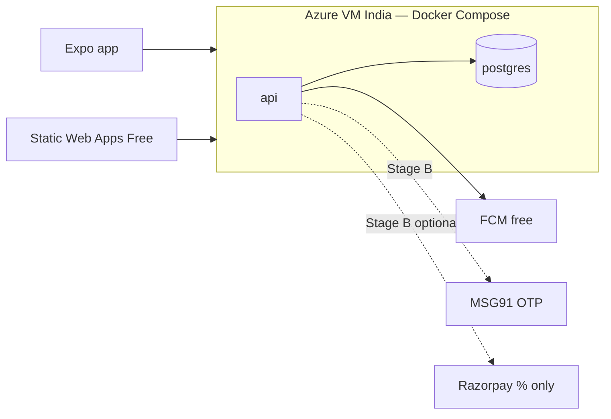

# e-Food Center — Lean Azure Hosting & Cost Sheet (Startup)

> **Status:** Revised for startup budget — **Lean Launch first**  
> **Goal:** Near-zero monthly cost to start; grow spend only when stakeholders ask / revenue appears  
> **Non‑negotiable:** App stays **up** (no sleep/cold‑kill); UI stays **stable** (simple screens, no fancy extras)  
> **Region:** Azure **Central India** or **South India**  
> **Owner of bills:** Somnath  
> **Last updated:** 2026-07-17  
> **Disclaimer:** Tentative INR. Confirm in Azure Pricing Calculator. Use free credits when available.

---

## 0. Honest truth (for stakeholder conversations)

| Myth | Reality |
|------|---------|
| “₹0 forever on cloud” | **Always-on** India hosting has a small floor (~phone prepaid). Free App Service **sleeps** → app “stops” — we reject that for customers. |
| “Managed Postgres + Redis + ACA + CDN now” | Correct for later scale — **wrong for day‑1 startup**. |
| “Payment gateway monthly rent” | **Razorpay has no monthly fee**. Cheapest start = **COD only** (₹0). Online pay = % of sales only when you enable it. |

**Stakeholder line you can use:**

> “We launch on a lean always-on Azure box (~₹2–4k/month all‑in infra). No Maps, no Redis, no CDN, no online payment rent. COD first. Fancy pieces unlock when you approve the feature and the budget.”

---

## 1. Strategy — three cost stages

```
STAGE A — Lean Launch (now)     → almost free / ₹2–4k infra
STAGE B — Earn & Stabilize      → add OTP SMS care, backups, Razorpay if needed
STAGE C — Scale Path (later)    → managed DB, Container Apps, Redis, CDN…
```

| Stage | When | Monthly infra target | What you get |
|-------|------|----------------------|--------------|
| **A Lean** | Private beta → first live branch | **₹0* – 4,000** | App up 24×7, stable basic UI, COD orders |
| **B Stabilize** | Regular daily orders | **₹4,000 – 8,000** | Better backup, SMS OTP at volume, optional UPI |
| **C Scale** | Multi-branch / heavy traffic | **₹15,000+** | Managed Postgres/Redis, ACA, CDN (old “enterprise” sheet) |

\* **₹0 infra** only while **Azure free credits** last, or if you temporarily use a free always-on credit program. Plan the **₹2–4k** floor after credits end.

---

## 2. Best path for “almost free + never stops + stable UI”

### 2.1 Recommended Lean architecture

**One small Azure VM (Linux) + Docker Compose** in India:

| Piece | Lean choice | Why |
|-------|-------------|-----|
| Compute | **1× Azure VM** (e.g. `Standard_B1s` / `B2ats_v2`) always on | Cheapest reliable “does not sleep” |
| Runtime | **Docker Compose**: `api` + `postgres` (+ later `admin` nginx) | Your Docker preference; one bill |
| Admin UI | **Azure Static Web Apps — Free** | ₹0; stable React admin |
| Mobile | **Expo** (EAS free tier for early builds) | No server cost |
| DB | **Postgres in Docker on same VM** | ₹0 extra vs managed Flexible Server |
| Redis / queue | **Skip** — send push inline; cron later | Saves ₹1.5k–4k/mo |
| Images | Disk on VM **or** tiny Blob (₹0–100) | Defer CDN |
| Secrets | `.env` on VM (locked down) → Key Vault later | Defer KV cost |
| Registry | Build on VM or GitHub Actions → deploy | Defer ACR |
| HTTPS | **Caddy** or Nginx + Let’s Encrypt on VM | ₹0 |
| Domain | Cheap `.in` / existing | ~₹100/mo averaged |



### 2.2 What we deliberately postpone (until stakeholder asks)

| Fancy / costly | Stage | Trigger to add |
|----------------|-------|----------------|
| Google Maps | C | Real geo zones / live tracking demanded |
| Azure Cache for Redis | C | Queue lag / multi-instance |
| Managed PostgreSQL Flexible | C | Need HA / point-in-time without DIY |
| Azure Container Apps + ACR | C | Outgrow one VM |
| Front Door / CDN | C | Heavy image traffic |
| Email / WhatsApp | B–C | Stakeholder request |
| Online payment (Razorpay) | B | “Customers want UPI” |
| Multi-branch complexity | B–C | Second branch live |
| Coupons / referral / loyalty | B–C | Marketing ask |
| POS / thermal print | B–C | Kitchen hardware ready |

### 2.3 Product lean (stable UI, basic features only)

Ship **only** wireframe basics:

1. Browse menu (guest OK)  
2. OTP login at checkout *(or staff-assisted accounts in private beta — see SMS)*  
3. Cart + **COD** + pickup/delivery text address  
4. Order status (simple timeline) + **FCM push** (free)  
5. Admin: products + order queue approve/complete  

No maps UI, no promo carousels, no chat, no wallet, no dark-mode polish pass.

---

## 3. Payments — least cost first

| Phase | Method | Monthly fee | Variable fee |
|-------|--------|-------------|--------------|
| **A Lean** | **COD only** | **₹0** | ₹0 |
| **B** | COD + **Razorpay UPI** (add when asked) | **₹0** | ~1.5–2% of online GMV only |
| Later | Cards/wallets if needed | ₹0 | Same gateway % |

**Do not** buy a gateway with monthly rental. Razorpay (or similar) is pay‑per‑success.

COD ops: admin day-end collection screen (already in wireframes) — process cost, not cloud cost.

---

## 4. SMS / OTP — keep tiny

SMS is the silent bill killer.

| Approach | Cost | Use when |
|----------|------|----------|
| **Private beta:** seed staff/customer phones in admin; optional fixed test OTP in Staging only | ₹0 | Internal testing |
| **Lean live:** MSG91 OTP **only on login** (not every order SMS) | Pay-as-you-go | First public users |
| Order updates | **FCM push only** (free) | Always in Lean |
| Order SMS | Add later | Stakeholder insists |

Rough OTP-only: 50 logins/day × ₹0.20 ≈ **₹300/month** — still cheap.

---

## 5. Revised cost sheet (stakeholder-friendly)

### 5.1 STAGE A — Lean Launch (approve this first)

| Item | Tentative ₹ / month | Notes |
|------|---------------------|-------|
| Azure VM B1s/B2ats (always on) | 1,200 – 2,800 | Core — keeps app alive |
| Public IP + disk + tiny egress | 200 – 600 | |
| Static Web Apps (admin) | **0** | Free tier |
| Blob (optional images) | 0 – 100 | |
| Domain (annual ÷ 12) | 80 – 150 | |
| FCM / Expo | **0** | |
| Payment gateway | **0** | COD only |
| Maps / Redis / managed DB / CDN / ACR | **0** | Deferred |
| **Infra subtotal** | **≈ 1,500 – 3,500** | |
| MSG91 OTP (light) | 0 – 500 | Volume-linked |
| **Planning total Stage A** | **≈ ₹2,000 – 4,000** | |

**One-time (not monthly):**

| Item | Tentative | Note |
|------|-----------|------|
| Google Play | $25 | Once |
| Apple Developer | $99 / yr | **Defer iOS** until Android proves demand → save ~₹8k/yr initially |
| Azure free credits | Often available on new sub | Burn these in month 1–2 |

### 5.2 STAGE B — Stabilize (after orders are real)

| Add-on | Extra ₹ / month | When |
|--------|-----------------|------|
| Stronger VM (B2s) or snapshot backups to Blob | +1,000 – 2,500 | Daily orders stable |
| Razorpay UPI | 0 rent; % of GMV | Stakeholder asks for online pay |
| MSG91 at higher volume | +500 – 3,000 | More OTP users |
| **Band** | **≈ ₹4,000 – 8,000** + Razorpay % | |

### 5.3 STAGE C — Scale Path (old “full Azure” model)

Only when one VM is not enough: managed Postgres, Redis, Container Apps, CDN.  
See appendix — **do not present Stage C numbers as the launch ask.**

| Band | Approx |
|------|--------|
| Early scale | ₹15,000 – 30,000 infra |
| Heavier | ₹45,000+ |

---

## 6. Reliability without expensive HA

| Risk | Lean control (cheap) |
|------|----------------------|
| VM crash / patch | Azure **VM backup** or nightly `pg_dump` to Blob + documented restore (1–2 hr RTO OK for MVP) |
| Disk full | Log rotate; image size limits |
| Bad deploy | Docker Compose recreate from last known good tag; keep previous image |
| Sleeping free tier | **Never use F1/free App Service for Prod API** |
| UI breakage | Ship locked wireframes; no drive-by redesigns |

SLA honesty for Lean: aim **~99%** with fast manual restore — upgrade HA when revenue pays for managed DB.

---

## 7. Local → Azure parity (Docker)

```
docker-compose.yml     # api + postgres (+ admin optional)
packages/api/Dockerfile
```

Same Compose file shape on laptop and VM. Later (Stage C) split services to ACA without rewriting business code.

---

## 8. Decision updates (Lean)

| ID | Lean decision |
|----|----------------|
| D4 | **Azure India + Docker on one VM (Compose)** for Stage A/B; graduate to ACA + managed DB in Stage C |
| D5 | **COD first**; Razorpay UPI when stakeholder requests (no monthly fee) |
| D6 | MSG91 OTP only when going public; minimize SMS |
| D8 | FCM for order status from day 1 (free) |
| D9 | **No Google Maps in Lean** — text address + pincode/zone list |
| D10 | **Android first** optional to defer Apple fee |

---

## 9. Approval (locked)

| Question | Answer | Date |
|----------|--------|------|
| Stage A budget **₹2,000 – 4,000 / month** | ✅ **Yes** | 2026-07-17 |
| COD-only at launch | ✅ **Yes** | 2026-07-17 |
| Defer Maps / Redis / managed DB / CDN | ✅ **Yes** | 2026-07-17 |
| Android-first (no iOS immediately) | ✅ **Yes** | 2026-07-17 |

| Role | Name | Date |
|------|------|------|
| Tech | Somnath Das | 2026-07-17 |
| Business | Sarthak Ghosh | Informed / aligned on cost band |

---

## Appendix — Stage C (do not use as launch quote)

Former full stack (ACA + Flexible Server + Redis + ACR + Insights): roughly **₹15k–70k+/mo** depending on traffic. Revisit only after Lean is earning or multi-instance is required.
