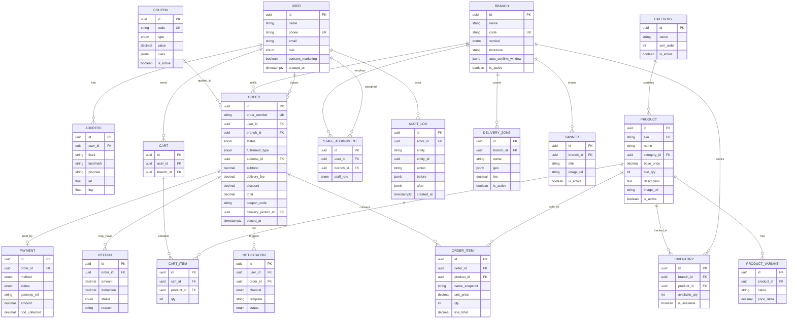

# e-Food Center — Entity Relationship Diagram (MVP)

> **Status:** Proposed for approval  
> **Version:** 0.1  
> **Companion:** `docs/architecture.md` · `REQUIREMENTS.md` §8

---

## 1. ERD (logical)

---

## 2. Entity notes (MVP)

| Entity | Notes |
|--------|-------|
| `USER.role` | `customer` \| `staff` \| `manager` \| `admin` |
| `BRANCH.vertical` | `food` for MVP; future: retail, veg, household |
| `PRODUCT.min_qty` | e.g. biryani=1, momos=2 |
| `ORDER.status` | Placed → Confirmed → InProgress → Completed → Closed; Cancelled / Refunded / PaymentFailed |
| `ORDER.fulfillment_type` | `delivery` \| `pickup` |
| `PAYMENT.method` | `razorpay` \| `cod` |
| `INVENTORY` | Unique `(branch_id, product_id)` |
| Snapshots | `ORDER_ITEM.name_snapshot` + `unit_price` freeze catalog changes after place |

---

## 3. Indexes (critical)

- `user.phone` unique
- `order.order_number` unique
- `order (branch_id, status, placed_at)`
- `inventory (branch_id, product_id)` unique
- `payment.gateway_ref` unique where not null
- `audit_log (entity, entity_id, created_at)`

---

## 4. Approval

| Role | Name | Decision | Date |
|------|------|----------|------|
| Tech Lead | Somnath Das | ☐ Approve · ☐ Changes · ☐ Reject | |
| Business Owner | Sarthak Ghosh | ☐ Approve · ☐ Changes · ☐ Reject | |
